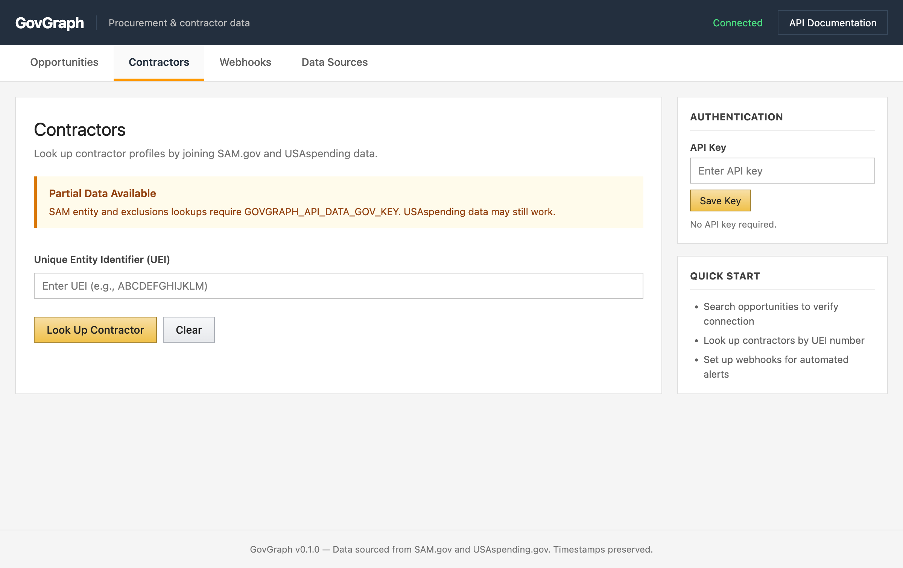
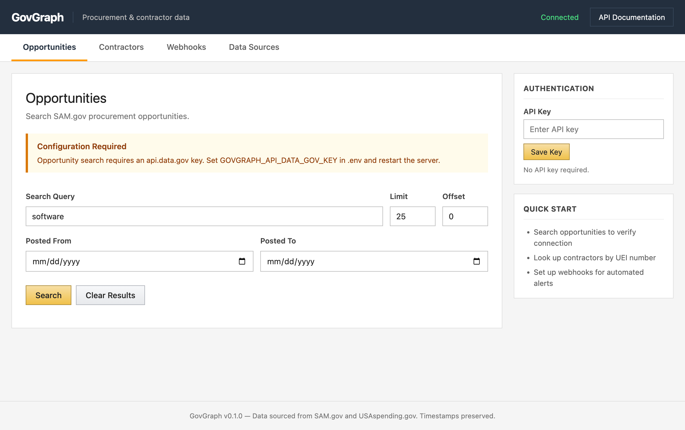
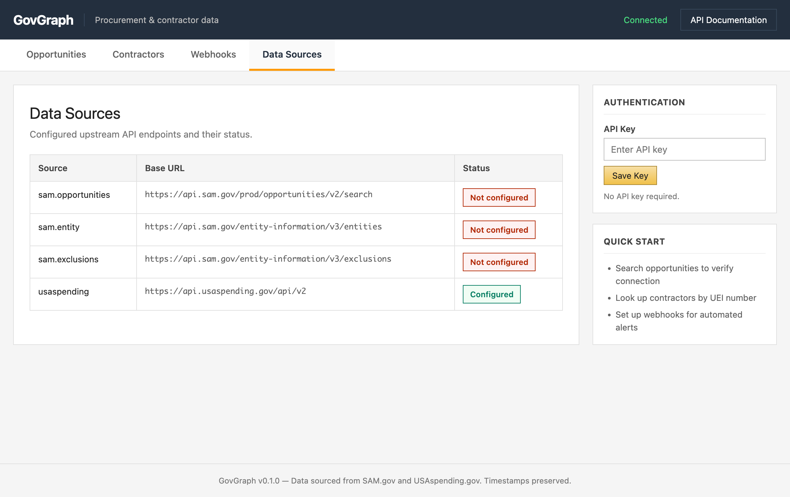

# GovGraph

clean JSON over SAM.gov and USAspending.gov, with a signed webhook on new opportunities.

- `GET /v1/contractors/{uei}` joins SAM entity, SAM exclusions, and USAspending awards for one UEI
- `GET /v1/opportunities` searches and normalizes SAM.gov solicitations; a poller fires the webhook on new notices
- `/v1/sources` reports which upstreams are wired up

[](docs/figures/contractors.png)
[](docs/figures/opportunities.png)
[](docs/figures/data-sources.png)

```bash
cp .env.example .env
PYTHONPATH=src python -m uvicorn govgraph.main:app --reload
```

SAM.gov needs a free api.data.gov key in `.env` as `GOVGRAPH_API_DATA_GOV_KEY`; USAspending needs nothing. Poller off by default; set `GOVGRAPH_ENABLE_POLLER=true` for live webhooks.
