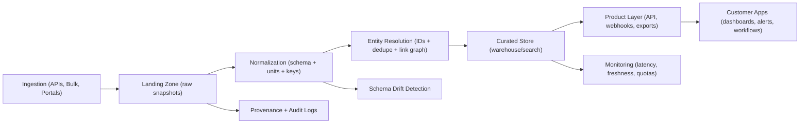

# Public-Sector Data APIs: Customer Segmentation & Market Opportunity Analysis (US)
As of: **February 3, 2026**

Scope: **US federal + state + local** public-sector data sources (APIs, bulk downloads, and government-operated open data portals), plus public-sector access systems that materially affect key workflows (e.g., PACER).

## Executive Summary
- Public-sector data is abundant, but “API availability” is not the same as **product-ready data**: customers pay for normalization, entity resolution, freshness guarantees, and workflow integrations—not for raw endpoints.
- The most repeatable business pattern is **pick one workflow + one data family**, then win on (1) clean schema, (2) cross-source joins, (3) reliability, and (4) alerting/exports.
- The biggest structural gap is **state/local fragmentation** (courts, permits, property, licensing): even when “data exists,” it is scattered across thousands of systems with inconsistent identifiers and access patterns.
- High-value federal sources (e.g., SEC EDGAR, SAM.gov/USAspending, EPA, NOAA) are usable, but **rate limits** and **schema drift** require a real ingestion platform (caching, backfills, monitoring).
- Segment scoring (below) suggests the best “new entrant” wedges cluster around **GovCon workflows**, **environmental facility-level integration**, and **targeted compliance monitoring**—with real estate being the hardest due to county-by-county operational barriers.
- The highest-ROI opportunities for 90-day MVPs generally emphasize **aggregation + normalization** over “predictive ML,” unless a unique dataset moat exists.

## Methodology

### Definitions
- **Source**: A government-run dataset, portal, or API; or a public-sector access system (paid or free) that is a practical dependency for customer workflows (e.g., court record access).
- **API**: A documented programmatic interface (REST, GraphQL, SOAP, OData, etc.), including “API-style” JSON endpoints even if informal.
- **Portal**: A government-operated data portal intended for browsing, downloads, or query interfaces (may include built-in APIs).
- **Bulk**: Data provided primarily as downloadable files (CSV, JSON, XML, PDF, shapefiles, etc.) rather than queryable endpoints.
- **Segment saturation**: A structured estimate of how well existing commercial offerings meet customer needs, considering incumbents, data accessibility, and operational friction.
- **Underserved opportunity**: A product concept where (a) customers have clear demand, (b) public-sector data access is feasible, and (c) value can be created via normalization/integration/reliability.

### Source Inclusion Criteria (Deterministic)
A source is included if it is:
1) **Government-run**, or
2) A **government-operated open data portal**, or
3) A **public-sector access system** that materially affects a segment (e.g., PACER), even if not a modern API;
and it must be relevant to at least one of the 8 segments.

### Citation Rules
- Any **numeric** external claim (prices, rate limits/caps, counts, revenue figures) must have a citation.
- If a numeric claim can’t be verified, it is either removed or labeled **Unverified**.

### Pricing Caveat (Boilerplate)
Pricing varies by seat count, contract term, and negotiation; ranges are publicly reported/published, as of **Feb 3, 2026**.

## Public-Sector Data Source Catalog (50+ Sources)

| Source | Owner | Gov Level | Access | Auth | Formats | Rate Limits / Caps | Update / Freshness | Docs / Reference | Notes |
|---|---|---|---|---|---|---|---|---|---|
| Data.gov | GSA | Federal | Portal + API | None | Metadata: JSON; datasets vary | Not published | Continuous | https://data.gov/developer/ | Catalog/metadata hub; underlying dataset terms vary. |
| api.data.gov (API key service) | GSA | Federal | API key gateway | API key | N/A | Published hourly caps (varies by API); see docs | N/A | https://api.data.gov/docs/ | Used by multiple federal APIs (e.g., Regulations.gov, NPS, NASA). |
| USAspending.gov API | Treasury (Bureau of the Fiscal Service) | Federal | API | None | JSON | Not published | Regular refresh (timing varies) | https://api.usaspending.gov/ | Spending + award data; used heavily in GovCon analytics. |
| SAM.gov Get Opportunities Public API | GSA | Federal | API | API key (api.data.gov) | JSON | Not published | Daily refresh (active notices) | https://open.gsa.gov/api/opportunities-api/ | For federal procurement notices/opportunities; archived notices updated weekly. |
| SAM.gov Entity Management Public API | GSA | Federal | API | System account + API key | JSON | 10/day (demo), 1,000/day (standard), 10,000/day (test); “unlimited” prod with onboarding | Daily | https://open.gsa.gov/api/entity-api/ | Also used for registration/UEI lookups; access depends on onboarding. |
| SAM.gov Contract Awards Public API | GSA | Federal | API | API key | JSON | Not published | Regular refresh (timing varies) | https://open.gsa.gov/api/contract-awards/ | Award / contract data products (scope varies by endpoint). |
| SAM.gov Exclusions Public API | GSA | Federal | API | System account + API key | JSON | 10/day (demo), 1,000/day (standard), 10,000/day (test); “unlimited” prod with onboarding | Daily | https://open.gsa.gov/api/exclusions-api/ | Exclusions/debarment data; access requires system account. |
| SAM.gov PSC Public API | GSA | Federal | API | API key | JSON | Not published | Infrequent changes | https://open.gsa.gov/api/psc-api/ | Product/Service Codes reference data. |
| SAM.gov Entity/Exclusions Extracts Download API | GSA | Federal | API + bulk | API key | ZIP/CSV/JSON (extracts) | Not published | Daily extracts | https://open.gsa.gov/api/entity-download-api/ | Useful for bulk sync; complements query APIs. |
| SAM.gov Assistance Subaward Reporting Public API | GSA | Federal | API | API key | JSON | Not published | Regular refresh (timing varies) | https://open.gsa.gov/api/assistance-subaward-reporting/ | Subaward data for assistance awards. |
| SAM.gov Acquisition Subaward Reporting Public API | GSA | Federal | API | API key | JSON | Not published | Regular refresh (timing varies) | https://open.gsa.gov/api/acquisition-subaward-reporting/ | Subaward data for contracts. |
| Regulations.gov API (v4) | EPA (program) | Federal | API | API key (api.data.gov) | JSON | General API caps + comments API caps (published) | Near real-time | https://open.gsa.gov/api/regulationsgov/ | Rulemaking + comments; comments endpoint is more restricted. |
| Federal Register API | National Archives (OFR) | Federal | API | None | JSON | Not published | Near real-time | https://www.federalregister.gov/developers/api/v1 | Rules/notices/presidential docs; good for regulatory monitoring. |
| govinfo API | GPO | Federal | API | API key (api.data.gov) | JSON | Not published | Regular refresh (timing varies) | https://api.govinfo.gov/docs/ | Congressional bills, Federal Register, CFR, and more. |
| Congress.gov API | Library of Congress | Federal | API | API key | JSON | 5,000 requests/hour (published) | Regular refresh (timing varies) | https://api.congress.gov/ https://github.com/LibraryOfCongress/api.congress.gov | Legislative data (bills, members, etc.). |
| eCFR API | National Archives (OFR) | Federal | API | None | JSON | Not published | Regular refresh (timing varies) | https://www.ecfr.gov/developers/documentation/api/v1 | Machine-readable CFR slices (titles/parts/versions). |
| PACER (federal court records access) | U.S. Courts | Federal | Paid system | Account | HTML/PDF (downloads); no public API | $0.10/page with per-document cap (published); other fee rules apply | Near real-time | https://pacer.uscourts.gov/pacer-pricing-how-fees-work | Not a modern API; practical dependency for litigation data. |
| SEC EDGAR APIs (Submissions/XBRL, etc.) | SEC | Federal | API | None | JSON | Fair-access guideline: ≤10 requests/second | Real-time (published latency targets) | https://www.sec.gov/os/accessing-edgar-data https://www.sec.gov/edgar/sec-api-documentation | CIK-centric data; entity resolution with other registries is non-trivial. |
| Treasury Fiscal Data API | U.S. Treasury | Federal | API | None | JSON/CSV | Not published | Regular refresh (timing varies) | https://fiscaldata.treasury.gov/api-documentation/ | Budget, debt, revenue, and other fiscal datasets. |
| IRS Statistics of Income (SOI) Tax Stats | IRS | Federal | Bulk | None | XLS/CSV/PDF (varies) | N/A | Annual/periodic (dataset-dependent) | https://www.irs.gov/statistics/soi-tax-stats | High-value demographics/income stats; not typically API-first. |
| Census Data API | U.S. Census Bureau | Federal | API | Optional API key | JSON | Unkeyed usage is limited (published); keys recommended | Regular releases (dataset-dependent) | https://www.census.gov/data/developers/guidance/api-user-guide.Important_Considerations.html | ACS/Decennial/business datasets; core for geo + demographics. |
| Bureau of Labor Statistics (BLS) Public Data API | BLS | Federal | API | Optional API key | JSON | Registered: 500 queries/day; unregistered: 25/day; request-rate guidance published | Regular releases (series-dependent) | https://www.bls.gov/developers/api_faqs.htm | Strong demand; quotas constrain large-scale commercial use without bulk strategies. |
| Bureau of Economic Analysis (BEA) API | BEA | Federal | API | API key (“UserID”) | JSON | Not published | Regular releases (table-dependent) | https://apps.bea.gov/api/ | Macro data, industry accounts, regional stats. |
| FRED API | Federal Reserve Bank of St. Louis | Federal (quasi-public) | API | API key | JSON/XML | Not published | Regular releases (series-dependent) | https://fred.stlouisfed.org/docs/api/fred/ | Widely used macro time series; strong “developer tier” adoption. |
| FDIC BankFind / Bank Data API | FDIC | Federal | API | None | JSON | Not published | Regular refresh (timing varies) | https://banks.data.fdic.gov/docs/ | Bank/branch attributes; helpful for financial entity resolution. |
| FFIEC Call Report Data (CDR) | FFIEC | Federal | Portal + bulk | None | Bulk downloads (varies) | N/A | Quarterly/periodic | https://cdr.ffiec.gov/public/ | Call reports; MDRM code complexity drives parsing/normalization cost. |
| CFPB Consumer Complaint Database | CFPB | Federal | Portal + bulk | None | CSV/JSON | Not published | Regular refresh (timing varies) | https://www.consumerfinance.gov/data-research/consumer-complaints/ | Complaint narratives often require redaction/normalization; some fields limited. |
| USPTO PatentsView API | PatentsView (USPTO program) | Federal | API | None | JSON | Not published | Regular refresh (timing varies) | https://patentsview.org/apis/api-endpoints | Patent/grant and inventor/assignee graphs; entity resolution is core value. |
| HUD User Fair Market Rents (FMR) API | HUD | Federal | API | Bearer token | JSON | Not published | Annual/periodic | https://www.huduser.gov/portal/datasets/fmr/fmr-api.html | Useful for housing/RE analytics; token issuance required. |
| HUD User Income Limits API | HUD | Federal | API | Bearer token | JSON | Not published | Annual/periodic | https://www.huduser.gov/portal/datasets/il/il-api.html | Income limits by geography; complements FMR for eligibility modeling. |
| OpenFEMA API | FEMA | Federal | API | None | JSON (OData-style) | Not published | Regular refresh (dataset-dependent) | https://www.fema.gov/about/openfema/api | Often cited as a high-quality reference implementation for open data APIs. |
| NOAA National Weather Service (NWS) API | NOAA | Federal | API | None | JSON | Not published (politeness + caching expectations) | Near real-time | https://www.weather.gov/documentation/services-web-api | Weather forecasts/alerts; heavy caching required for scale. |
| NOAA NCEI Climate Data Online (CDO) API | NOAA | Federal | API | Token | JSON | 5 req/sec and 10,000 req/day (published) | Regular refresh (dataset-dependent) | https://www.ncei.noaa.gov/support/access-data-service-api-user-documentation | Climate data queries; quotas shape ETL strategies. |
| USGS Earthquake API | USGS | Federal | API | None | JSON/GeoJSON | Not published | Near real-time | https://earthquake.usgs.gov/fdsnws/event/1/ | Natural hazard signals (risk + insurance use cases). |
| EPA ECHO Web Services | EPA | Federal | API | None (varies) | JSON/XML (varies) | Not published | Regular refresh (dataset-dependent) | https://echo.epa.gov/tools/web-services | Compliance/violations; facility/entity resolution is a primary value-add. |
| EPA AQS API | EPA | Federal | API | API key | JSON/XML (varies) | Not published | Regular refresh (dataset-dependent) | https://aqs.epa.gov/aqsweb/documents/data_api.html | Certified air-quality monitoring data; complements AirNow. |
| EPA Envirofacts Data Service API | EPA | Federal | API | None | JSON/XML | Not published | Regular refresh (dataset-dependent) | https://www.epa.gov/enviro/envirofacts-data-service-api | Cross-program data services; older but useful for integration. |
| EPA Facility Registry Service (FRS) | EPA | Federal | Portal + bulk | None | Downloads (varies) | N/A | Regular refresh (timing varies) | https://www.epa.gov/frs | Canonical facility registry; useful for cross-program facility ID joins. |
| EPA TRI (Toxics Release Inventory) Data | EPA | Federal | Bulk (and some APIs via EPA services) | None | CSV/XLS (varies) | N/A | Annual | https://www.epa.gov/toxics-release-inventory-tri-program/tri-data-and-tools | High-value for ESG/supply-chain screening; annual cadence. |
| AirNow API | EPA (AirNow) | Federal | API | API key | JSON | Not published (limits vary by service) | Near real-time + historical | https://docs.airnowapi.org/ | Real-time AQ + forecast; separate from certified AQS data. |
| EIA Open Data API | EIA | Federal | API | API key | JSON | Not published | Regular refresh (series-dependent) | https://www.eia.gov/opendata/ | Energy prices/production; strong demand in ESG + trading. |
| USDA NASS Quick Stats API | USDA | Federal | API | API key | JSON/CSV | Max 50,000 records per request (published) | Regular refresh (dataset-dependent) | https://quickstats.nass.usda.gov/api | Agriculture stats; bulk + pagination patterns matter for ETL. |
| USDA FSIS Data API | USDA | Federal | API | API key | JSON | Not published | Regular refresh (dataset-dependent) | https://www.fsis.usda.gov/science-data/data-sets-visualizations/fsis-data-api | Includes recalls and other food safety datasets. |
| NHTSA Vehicle Product Information Catalog (vPIC) API | NHTSA | Federal | API | None | JSON | Not published | Regular refresh (timing varies) | https://vpic.nhtsa.dot.gov/api/ | Vehicle specs/decoding; paired with recall data for safety products. |
| NHTSA Datasets and APIs (incl. recalls) | NHTSA | Federal | Portal + API | None | JSON/CSV (varies) | Not published | Regular refresh (dataset-dependent) | https://www.nhtsa.gov/nhtsa-datasets-and-apis | Gateway to multiple datasets (recalls, crashes, etc.). |
| CPSC Recalls API | CPSC | Federal | API | None | JSON | Not published | Regular refresh (timing varies) | https://cpsc.github.io/ | Official CPSC open-data repo/docs for recalls access. |
| openFDA API | FDA | Federal | API | Optional API key | JSON | With key: up to 120,000 queries/day; without key: smaller published cap | Regular refresh (dataset-dependent) | https://open.fda.gov/apis/authentication/ | Drugs/devices/food endpoints; cleaning/deduping is the value layer. |
| ClinicalTrials.gov Data API | NIH | Federal | API | None | JSON | Not published | Daily refresh (published schedule) | https://clinicaltrials.gov/data-api/about-api | New API launched 2025; legacy API deprecated (timing published). |
| CMS Data Portal (data.cms.gov) | CMS | Federal | Portal + API | None (Socrata; keys optional) | JSON/CSV | Not published (platform limits vary) | Regular refresh (dataset-dependent) | https://data.cms.gov/ | Provider/utilization/quality datasets; heavy use in health analytics. |
| CMS Open Payments Data | CMS | Federal | Portal + API | None (Socrata; keys optional) | JSON/CSV | Not published (platform limits vary) | Annual/periodic | https://openpaymentsdata.cms.gov/ | Payment transparency; useful for provider intelligence products. |
| NIH RePORTER API | NIH | Federal | API | None (per docs) | JSON | Not published | Regular refresh (timing varies) | https://api.reporter.nih.gov/ | Grant funding signals; complements USASpending in R&D contexts. |
| NCBI E-utilities (PubMed, etc.) | NIH/NLM | Federal | API | Optional API key | XML/JSON (varies) | Published request-rate policies; keys increase limits | Near real-time | https://www.ncbi.nlm.nih.gov/books/NBK25500/ | Literature + biomedical metadata; strong health/research demand. |
| College Scorecard API | U.S. Dept. of Education | Federal | API | None | JSON | Not published | Regular refresh (timing varies) | https://collegescorecard.ed.gov/data/documentation/ | Education outcomes; supports credit risk and workforce analytics. |
| National Park Service (NPS) API | NPS | Federal | API | API key (api.data.gov) | JSON | Published hourly caps (via api.data.gov) | Regular refresh (timing varies) | https://www.nps.gov/subjects/developer/api-documentation.htm | Travel/geospatial use cases; also a model for api.data.gov-backed APIs. |
| GSA Per Diem API | GSA | Federal | API | API key (api.data.gov) | JSON | 1,000 requests/hour (published) | Annual/periodic | https://open.gsa.gov/api/perdiem/ | Travel rates; useful for GovCon + expense tooling. |
| NASA APIs | NASA | Federal | API | API key (optional) | JSON | With key: 1,000 req/hour; without key: 30 req/hour (published) | Regular refresh (dataset-dependent) | https://api.nasa.gov/ | Space/earth imagery metadata; varied datasets and quality. |
| NREL Developer Network APIs | NREL | Federal | API | API key | JSON | 1,000 req/hour; 5 req/sec (published) | Regular refresh (dataset-dependent) | https://developer.nrel.gov/docs/rate-limits/ | Energy + transportation datasets; supports ESG/cleantech analytics. |
| NVD (NIST) API | NIST | Federal | API | API key | JSON | Published per-key and per-minute limits | Regular refresh (timing varies) | https://nvd.nist.gov/developers | Vulnerability data; high demand in security + compliance. |
| LDA.gov API (Lobbying Disclosure) | U.S. Senate | Federal | API | None | JSON | Not published | Regular refresh (timing varies) | https://lda.senate.gov/api/ | Political influence data; terms and stability can change. |
| FEC OpenFEC API | FEC | Federal | API | API key | JSON | Not published | Regular refresh (timing varies) | https://api.open.fec.gov/developers/ | Core federal campaign finance dataset; entity resolution remains hard. |
| FAA Aircraft Registry “Releasable Aircraft Database” | FAA | Federal | Bulk | None | CSV/TXT (bulk download) | N/A | Daily/periodic | https://registry.faa.gov/database/ | Commonly requested; often requires tooling to normalize and keep current. |
| FPDS (legacy) | GSA | Federal | Portal + legacy interfaces | Varies | XML/CSV (varies) | N/A | Historical + periodic | https://www.fpds.gov/ | Legacy system migrating into SAM.gov ecosystem; migration risk. |
| California Open Data | State of California | State | Portal + API | None (platform keys optional) | JSON/CSV | Not published (platform limits vary) | Dataset-dependent | https://data.ca.gov/ | Mix of transportation, environment, health, etc. |
| New York State Open Data | NYS | State | Portal + API | None (platform keys optional) | JSON/CSV | Not published (platform limits vary) | Dataset-dependent | https://data.ny.gov/ | Includes business, health, education, public safety datasets. |
| Texas Open Data Portal | State of Texas | State | Portal + API | None (platform keys optional) | JSON/CSV | Not published (platform limits vary) | Dataset-dependent | https://data.texas.gov/ | Large state portal; coverage varies by agency. |
| Washington State Open Data | State of Washington | State | Portal + API | None (platform keys optional) | JSON/CSV | Not published (platform limits vary) | Dataset-dependent | https://data.wa.gov/ | Useful for licensing, transportation, and environmental data. |
| Maryland Open Data | State of Maryland | State | Portal + API | None (platform keys optional) | JSON/CSV | Not published (platform limits vary) | Dataset-dependent | https://opendata.maryland.gov/ | Includes procurement, health, and geospatial datasets. |
| Colorado Information Marketplace | State of Colorado | State | Portal + API | None (platform keys optional) | JSON/CSV | Not published (platform limits vary) | Dataset-dependent | https://data.colorado.gov/ | Mixed administrative and geospatial datasets. |
| Massachusetts Open Data | Commonwealth of Massachusetts | State | Portal + API | None (platform keys optional) | JSON/CSV | Not published (platform limits vary) | Dataset-dependent | https://data.mass.gov/ | Public health, education, transportation, etc. |
| Illinois Data Portal | State of Illinois | State | Portal + API | None (platform keys optional) | JSON/CSV | Not published (platform limits vary) | Dataset-dependent | https://data.illinois.gov/ | State datasets including procurement and workforce. |
| NYC Open Data | City of New York | Local | Portal + API | None (platform keys optional) | JSON/CSV | Not published (platform limits vary) | Dataset-dependent | https://opendata.cityofnewyork.us/ | Major municipal portal; includes permits, inspections, 311, etc. |
| Chicago Data Portal | City of Chicago | Local | Portal + API | None (platform keys optional) | JSON/CSV | Not published (platform limits vary) | Dataset-dependent | https://data.cityofchicago.org/ | Crime, permits, inspections, transportation, etc. |
| Los Angeles Open Data | City of Los Angeles | Local | Portal + API | None (platform keys optional) | JSON/CSV | Not published (platform limits vary) | Dataset-dependent | https://data.lacity.org/ | Municipal data; good for permit/inspection use cases. |
| San Francisco Open Data | City/County of San Francisco | Local | Portal + API | None (platform keys optional) | JSON/CSV | Not published (platform limits vary) | Dataset-dependent | https://data.sfgov.org/ | Strong public safety, permitting, and service request datasets. |
| Seattle Open Data | City of Seattle | Local | Portal + API | None (platform keys optional) | JSON/CSV | Not published (platform limits vary) | Dataset-dependent | https://data.seattle.gov/ | Municipal operations and permitting datasets. |
| Washington, DC Open Data | District of Columbia | Local | Portal + API | None | GIS/GeoJSON/CSV (varies) | Not published (platform limits vary) | Dataset-dependent | https://opendata.dc.gov/ | ArcGIS-backed portal; zoning and parcel layers often key. |
| Boston Open Data | City of Boston | Local | Portal + API | None | CSV/GeoJSON (varies) | Not published | Dataset-dependent | https://data.boston.gov/ | Municipal datasets; permitting + property often useful. |
| Austin Open Data | City of Austin | Local | Portal + API | None (platform keys optional) | JSON/CSV | Not published (platform limits vary) | Dataset-dependent | https://data.austintexas.gov/ | Municipal datasets; permits and inspections. |
| OpenDataPhilly | City of Philadelphia (and partners) | Local | Portal + API | None | JSON/CSV (varies) | Not published (platform limits vary) | Dataset-dependent | https://www.opendataphilly.org/ | Municipal datasets, some via ArcGIS/Socrata. |
| Miami-Dade Open Data | Miami-Dade County | Local | Portal + API | None | GeoJSON/CSV (varies) | Not published (platform limits vary) | Dataset-dependent | https://gis-mdc.opendata.arcgis.com/ | County-level geospatial layers (permits, parcels, zoning where available). |

### Common Technical Patterns
- **Rate limits are a first-class product constraint.** Many high-value sources publish strict quotas (e.g., SEC fair access, NOAA CDO, BLS query caps), which pushes commercial products toward caching, bulk sync, and incremental updates.
- **Shared API gateways normalize auth but also centralize quotas.** Several federal APIs rely on `api.data.gov` keys; this reduces auth complexity but can impose consistent hourly caps across otherwise unrelated datasets.
- **Bulk downloads are the scalability escape hatch.** When available, bulk extracts (e.g., SAM entity downloads, IRS SOI files, FFIEC distributions) are typically more reliable for backfills than per-record API pulls.
- **Format inconsistency persists.** JSON is dominant for modern APIs; older or domain-specific systems still use XML/SOAP, GIS formats, PDFs, or mixed packages (ZIPs containing CSVs + metadata).
- **Entity resolution is the durable value layer.** Crosswalking identifiers (UEI/DUNS legacy, CIK, RSSD, FDIC certificate, facility IDs, provider NPIs) is rarely provided “out of the box.”
- **Deprecation/migration risk is common.** Major systems are periodically replaced (e.g., ClinicalTrials.gov API transition; FPDS migration into SAM.gov ecosystem), so products must invest in monitoring and versioned ingestion.

## Customer Segmentation (8 Segments) — Re-derived

### Saturation Rubric (Deterministic)
Score each segment 1–5 on each dimension:
- **Demand/WTP (1–5)**: 1 = $0–$50/mo typical; 3 = $100–$500/mo; 5 = $1k+/mo or enterprise $10k+/yr per seat.
- **Data Accessibility (1–5)**: 1 = no API + fragmented portals; 3 = bulk + partial APIs; 5 = clean APIs + docs.
- **Normalization Difficulty (1–5)**: 1 = already standardized; 5 = heavy entity resolution / messy schemas.
- **Incumbent Intensity (1–5)**: 1 = no clear incumbents; 5 = dominant entrenched incumbents with broad coverage.
- **Operational Friction (1–5)**: 1 = low ongoing ops; 5 = high ops (jurisdiction-by-jurisdiction deals, scraping defenses, frequent schema changes).

Compute:
- `Attractiveness = 2*Demand + (6 - Incumbent Intensity)` (range 3–15)
- `Feasibility = 2*Data Accessibility + (6 - Normalization Difficulty) + (6 - Operational Friction)` (range 4–17)
- `Segment Opportunity Score = Attractiveness + Feasibility` (range 7–32)

Color mapping:
- **🟢 Green**: 24–32
- **🟡 Yellow**: 16–23
- **🔴 Red**: 7–15

### Segment Summary Table (Recomputed)
| Segment | Demand | Data Access | Normalize | Incumbents | Ops Friction | Attractiveness | Feasibility | Score | Color |
|---|---:|---:|---:|---:|---:|---:|---:|---:|---|
| Legal / Compliance | 5 | 2 | 4 | 4 | 4 | 12 | 8 | 20 | 🟡 |
| Financial Services | 5 | 3 | 5 | 5 | 3 | 11 | 10 | 21 | 🟡 |
| Sales / Marketing | 4 | 4 | 4 | 2 | 3 | 12 | 13 | 25 | 🟢 |
| Journalism / Research | 1 | 4 | 3 | 3 | 3 | 5 | 14 | 19 | 🟡 |
| Real Estate | 4 | 2 | 5 | 5 | 5 | 9 | 6 | 15 | 🔴 |
| Government Contractors | 4 | 3 | 3 | 4 | 3 | 10 | 12 | 22 | 🟡 |
| ESG / Environmental | 4 | 3 | 4 | 3 | 3 | 11 | 11 | 22 | 🟡 |
| Healthcare / Pharma | 5 | 3 | 5 | 5 | 4 | 11 | 9 | 20 | 🟡 |

### Legal / Compliance
**What they need**
- **Court records and dockets** (federal + state), including filings, orders, and docket events.
- **Alerts** for docket changes, regulatory changes, enforcement actions, and new guidance.
- **Litigation analytics**: judge/court stats, motion outcomes, timelines, and party/counsel graphs.
- **Compliance monitoring**: rule changes, consent decrees, and enforcement actions mapped to business entities.

**Key public-sector sources**
- PACER (federal dockets and documents): **PACER (federal court records access)**.
- Federal legal/regulatory publications: **govinfo API**, **Federal Register API**, **eCFR API**, **Regulations.gov API (v4)**.
- Company/regulatory filings that drive legal/compliance workflows: **SEC EDGAR APIs (Submissions/XBRL, etc.)**.
- State court systems: not standardized; often outside modern open-data patterns (varies by jurisdiction).

**Commercial landscape**
- Enterprise legal research and analytics suites offer broad coverage and deep editorial features, often under negotiated contracts (seat-based and firm-wide deals).
- “Budget-tier” products tend to compete on narrow slices: docket tracking, alerts, or single-practice specialization (bankruptcy, immigration, IP, etc.).
- Data vendors differentiate via (1) docket normalization, (2) full-text indexing, (3) cross-jurisdiction coverage, and (4) entity resolution.

**Saturation score + color**
- **Score: 20 (🟡)** — High willingness to pay, but feasibility is limited by state-court fragmentation and high operational friction.
- Rubric inputs: Demand 5, Data Access 2, Normalize 4, Incumbents 4, Ops Friction 4.

**Willingness to pay**
- High for organizations with recurring litigation/compliance exposure; budgets often justify premium pricing when the product saves attorney time or reduces risk.
- Paid access costs (e.g., PACER fees) also create incentives for caching, deduplication, and document sharing where permitted.

**Critical gaps**
- **State court aggregation** remains fragmented and operationally difficult (different vendors, formats, and access rules).
- **Immigration court** and other administrative adjudication systems sit outside PACER-style access patterns.
- Older records and scanned documents frequently require OCR + metadata extraction.
- Real-time docket alerts and litigation analytics often require expensive enterprise subscriptions.

### Financial Services
**What they need**
- SEC filings (10-K/10-Q/8-K, XBRL), issuer + security master data, enforcement actions.
- Macroeconomic indicators and labor statistics (time series, revisions).
- Bank regulatory and institution datasets (call reports, bank attributes).
- Robust entity resolution across identifiers (CIK/RSSD/FDIC certificate, etc.).

**Key public-sector sources**
- **SEC EDGAR APIs (Submissions/XBRL, etc.)**
- Macro and labor: **FRED API**, **Bureau of Labor Statistics (BLS) Public Data API**, **Bureau of Economic Analysis (BEA) API**, **Census Data API**
- Banking and financial institutions: **FDIC BankFind / Bank Data API**, **FFIEC Call Report Data (CDR)**, **Treasury Fiscal Data API**
- Energy markets (common for macro/commodities desks): **EIA Open Data API**

**Commercial landscape**
- Large incumbents provide integrated terminals and deep analytics with extensive non-government sources and proprietary content.
- Developer-focused vendors compete on “structured SEC” (XBRL normalization, statement standardization, faster updates, and easier SDKs).
- The moat is rarely “having EDGAR data” and more often: standardized financial statements, deduped entity graphs, and consistent time-series revisions.

**Saturation score + color**
- **Score: 21 (🟡)** — Demand is extremely high, but incumbents are strong and normalization complexity is a core barrier.
- Rubric inputs: Demand 5, Data Access 3, Normalize 5, Incumbents 5, Ops Friction 3.

**Willingness to pay**
- Very high when the dataset is differentiated (unique coverage, lower latency, or better normalization).
- Strong appetite exists for API-first tooling among small funds, fintechs, and developers when pricing is accessible and documentation is strong.

**Critical gaps**
- **XBRL variability** and tag inconsistency drives ongoing normalization cost.
- **Pre-standardization history** (older filings, document-only periods) complicates longitudinal models.
- **Cross-registry entity resolution** (CIK vs banking IDs vs LEI) is not delivered as a unified graph.
- Many workflows require combining public-sector data with proprietary data (pricing, fundamentals, ownership) to be actionable.

### Sales / Marketing
**What they need**
- Government-contractor lead lists (who sells to whom, where, and under what vehicles).
- Firmographics and contact workflows tailored to GovCon (territories, certifications, past performance).
- Qualification signals: registrations, exclusions, NAICS/PSC fit, award history, subcontracting patterns.
- Enrichment across fragmented business registries, permits, and licenses (state/local).

**Key public-sector sources**
- Federal contractor and award signals: **USAspending.gov API**, **SAM.gov Entity Management Public API**, **SAM.gov Contract Awards Public API**, **SAM.gov Get Opportunities Public API**.
- Reference/lookup tables to power CRMs and routing: **SAM.gov PSC Public API**.
- State/local business and permit signals (fragmented): state portals such as **California Open Data**, **New York State Open Data**, and large-city portals like **NYC Open Data** (coverage varies widely by jurisdiction).

**Commercial landscape**
- General B2B data providers excel at contact enrichment but typically lack public-sector-specific joins (UEI, award history, solicitations).
- GovCon platforms focus on opportunity discovery and proposal workflows more than outbound sales motions (lists, routing, sequencing, CRM-native enrichment).
- A common wedge is a GovCon-specific “data layer” that plugs into existing CRMs rather than replacing them.

**Saturation score + color**
- **Score: 25 (🟢)** — High demand in the GovCon-adjacent subset, and data is accessible enough to build meaningful integrated intelligence.
- Rubric inputs: Demand 4, Data Access 4, Normalize 4, Incumbents 2, Ops Friction 3.

**Willingness to pay**
- Moderate-to-high where the product has clear pipeline ROI (qualified leads + timing + competitive context).
- Willingness to pay increases when outputs are workflow-native (Salesforce/HubSpot enrichment, notifications, and account planning exports).

**Critical gaps**
- **No canonical “government contractor CRM dataset.”** Users must manually reconcile SAM registrations, awards, and opportunities.
- **Certification/eligibility signals** are not always machine-verifiable in one place.
- **State business registries and licensing** remain fragmented and operationally expensive to normalize.
- Contact-level enrichment is often the missing non-government layer (must be sourced ethically and legally).

### Journalism / Research
**What they need**
- Public spending and contracts, campaign finance, lobbying, and ethics signals.
- Regulatory changes, enforcement actions, and historical archives.
- FOIA workflows and cross-agency tracking.
- Low-friction, low-cost access (often $0 budgets).

**Key public-sector sources**
- Political and influence: **FEC OpenFEC API**, **LDA.gov API (Lobbying Disclosure)**, **Congress.gov API**.
- Spending and procurement: **USAspending.gov API**, **SAM.gov Get Opportunities Public API**, **govinfo API**.
- Regulatory: **Federal Register API**, **Regulations.gov API (v4)**, **eCFR API**.
- Local accountability reporting: large portals like **NYC Open Data**, **Chicago Data Portal**, etc.

**Commercial landscape**
- Many successful tools in this segment are nonprofit-funded or subsidized (newsroom partnerships, foundations, grants).
- Commercial opportunities typically require cross-subsidy (selling enterprise features to other segments) or hybrid models (paid exports/alerts for advocacy and compliance teams).

**Saturation score + color**
- **Score: 19 (🟡)** — Data is relatively accessible and feasible to package, but willingness to pay is low, pushing viable models toward nonprofit or cross-subsidy.
- Rubric inputs: Demand 1, Data Access 4, Normalize 3, Incumbents 3, Ops Friction 3.

**Willingness to pay**
- Low for individual journalists and many researchers; higher for institutional users when the same data enables compliance or reputational risk products.

**Critical gaps**
- Cross-agency **FOIA request tracking** and searchable archives remain inconsistent.
- Entity resolution for political finance and lobbying (people + orgs) is still hard, especially across time and name variants.
- Many local datasets lack stable identifiers and change schemas without notice.

### Real Estate
**What they need**
- Parcel/property records, deeds, tax assessments, zoning, permits, and code enforcement.
- Federal overlays: flood risk, environmental risk, housing affordability, and demographic context.
- Integration with MLS or listing data (usually proprietary).

**Key public-sector sources**
- Risk and housing context: **OpenFEMA API**, **HUD User Fair Market Rents (FMR) API**, **HUD User Income Limits API**, **Census Data API**, **EPA TRI (Toxics Release Inventory) Data**.
- Local building and permitting signals: large-city portals (e.g., **Los Angeles Open Data**, **San Francisco Open Data**) where available.
- Core property records (assessor/deeds) are typically county/local systems and are not standardized across the US.

**Commercial landscape**
- Incumbents often win through long-lived county-by-county licensing, coverage breadth, and established workflows for lenders/insurers/CRE.
- New entrants can still win by focusing on narrow wedges (risk overlays, compliance screening, or specific metros), but broad national coverage is operationally heavy.

**Saturation score + color**
- **Score: 15 (🔴)** — The operational barrier (county-by-county + MLS relationships) dominates, even when the technical integration is straightforward.
- Rubric inputs: Demand 4, Data Access 2, Normalize 5, Incumbents 5, Ops Friction 5.

**Willingness to pay**
- High for national coverage and decision-grade analytics, but willingness to pay does not reduce the underlying operational burden of assembling the dataset.

**Critical gaps**
- **County assessor + deed integration** across thousands of jurisdictions remains the core barrier.
- Zoning data is frequently GIS-only, inconsistently published, and not standardized.
- “Joinable risk” (flood + affordability + environmental + permits) is rarely available as a clean parcel-level dataset without heavy normalization.

### Government Contractors
**What they need**
- Opportunity discovery (RFP/RFI), pipeline monitoring, and award history.
- Competitive intelligence (who wins, contract vehicles, set-asides).
- Partner/teaming discovery and subcontract signals.
- Workflow tooling for capture/proposal management.

**Key public-sector sources**
- Core procurement signals: **SAM.gov Get Opportunities Public API**, **SAM.gov Contract Awards Public API**, **USAspending.gov API**.
- Contractor identity and compliance: **SAM.gov Entity Management Public API**, **SAM.gov Exclusions Public API**, **SAM.gov Entity/Exclusions Extracts Download API**.
- Subaward signals: **SAM.gov Acquisition Subaward Reporting Public API**, **SAM.gov Assistance Subaward Reporting Public API**.

**Commercial landscape**
- Enterprise incumbents layer analyst research, capture intel, and predictive signals on top of public data.
- A durable SMB wedge is better UX and “just enough intelligence” (alerts, competitor history, vehicle awareness) at accessible price points.

**Saturation score + color**
- **Score: 22 (🟡)** — Strong demand, decent data access, but incumbents are entrenched and some visibility gaps are structural.
- Rubric inputs: Demand 4, Data Access 3, Normalize 3, Incumbents 4, Ops Friction 3.

**Willingness to pay**
- High where a tool directly improves win rate or reduces proposal overhead; teams often justify subscriptions with a single contract win.

**Critical gaps**
- **Pre-solicitation intelligence** is difficult without human/analyst input or privileged channels.
- Subcontracting data quality and coverage can be incomplete.
- Task order visibility under IDIQs varies by agency and vehicle.

### ESG / Environmental
**What they need**
- Facility-level environmental profiles (air/water/waste, violations, TRI releases).
- Climate and hazard overlays (flood, storm, temperature trends) linked to assets and suppliers.
- Auditable provenance for ESG reporting and due diligence.

**Key public-sector sources**
- Compliance and releases: **EPA ECHO Web Services**, **EPA Envirofacts Data Service API**, **EPA TRI (Toxics Release Inventory) Data**, **EPA AQS API**, **AirNow API**.
- Climate/hazards: **NOAA NCEI Climate Data Online (CDO) API**, **NOAA National Weather Service (NWS) API**, **USGS Earthquake API**, **OpenFEMA API**.
- Energy context: **EIA Open Data API**, **NREL Developer Network APIs**.

**Commercial landscape**
- Enterprise EHS platforms offer program management and audits, while many ESG data providers selectively incorporate public datasets.
- The integration gap persists: investors and supply-chain teams often need a **clean, unified, entity-resolved facility dataset** more than another dashboard.

**Saturation score + color**
- **Score: 22 (🟡)** — Integration and entity resolution are strong wedges; incumbents exist but aren’t always focused on investor/supply-chain workflows.
- Rubric inputs: Demand 4, Data Access 3, Normalize 4, Incumbents 3, Ops Friction 3.

**Willingness to pay**
- Moderate-to-high and rising for due diligence, supply-chain compliance, and investor risk analytics—especially when outputs can be audited back to public sources.

**Critical gaps**
- **Unified facility identity** across EPA programs is a recurring pain (IDs differ, names/addresses change).
- “Real-time” vs “certified historical” data sources are split (e.g., AirNow vs AQS), complicating product UX.
- Linking environmental liabilities to corporate structures (subsidiaries, private entities) requires non-government enrichment.

### Healthcare / Pharma
**What they need**
- Drug/device safety (adverse events, recalls/enforcement), approvals, and labeling.
- Provider/hospital quality metrics, utilization signals, and payment transparency.
- Clinical trial pipelines and research funding signals.
- (Often) claims-level outcomes, which are frequently restricted.

**Key public-sector sources**
- Drug/device and safety: **openFDA API**, **USDA FSIS Data API**, **CPSC Recalls API**, **NHTSA Datasets and APIs (incl. recalls)**.
- Clinical and research: **ClinicalTrials.gov Data API**, **NIH RePORTER API**, **NCBI E-utilities (PubMed, etc.)**.
- Provider and payments: **CMS Data Portal (data.cms.gov)**, **CMS Open Payments Data**.

**Commercial landscape**
- Enterprise incumbents combine claims data, EHR-derived signals, and curated provider databases—often gated behind strict compliance and large contracts.
- New entrants can win in niches where public data is strong and the value is in cleaning, deduping, and alerting (e.g., unified recall alerts, FAERS cleaning).

**Saturation score + color**
- **Score: 20 (🟡)** — High demand, but enterprise incumbents and restricted datasets limit feasibility for broad coverage; niches remain attractive.
- Rubric inputs: Demand 5, Data Access 3, Normalize 5, Incumbents 5, Ops Friction 4.

**Willingness to pay**
- Very high for pharma and regulated health organizations when a dataset reduces regulatory risk or improves speed-to-insight.

**Critical gaps**
- Claims-level datasets are often restricted (agreements, IRB, privacy), limiting “end-to-end patient journey” products for most startups.
- Public safety datasets frequently require heavy cleaning (duplicates, missingness, evolving schemas).
- Provider identity graphs (NPI + licenses + org ownership) often require significant enrichment beyond CMS datasets.

## 10 Underserved Opportunities — Re-derived

### Opportunity Scoring Rubric
Score each opportunity 1–5:
- **Customer urgency**
- **Data access readiness**
- **Differentiation leverage** (how much normalization/integration creates defensible value)
- **Competition gap** (5 = few/no direct offerings)
- **Regulatory/legal risk** (5 = low risk)

`Score = Urgency + Data + Differentiation + CompetitionGap + Risk` (range 5–25)

### Opportunity Ranking Table
| Rank | Opportunity | Target segment(s) | Key sources | Why now | MVP (90 days) | Pricing starting point | Risks | Score |
|---:|---|---|---|---|---|---|---|---:|
| 1 | Unified public-sector recall alerts API | Healthcare/Pharma; Sales/Marketing; Journalism/Research | openFDA API; CPSC Recalls API; NHTSA Datasets and APIs; USDA FSIS Data API | API availability + rising supply-chain/compliance needs | Normalize recall feeds + alerts + webhooks + exports | Suggest: $99–$499/mo + usage tiers | Liability/expectations; source schema drift; attribution | 20 |
| 2 | EPA facility environmental profile API | ESG/Environmental; Legal/Compliance; GovCon | EPA ECHO Web Services; EPA Envirofacts Data Service API; EPA TRI Data; EPA AQS API; AirNow API | ESG due diligence + supply-chain screening demand | Unified facility search + profile + timeline + CSV export | Suggest: $199–$999/mo + enterprise | Facility identity errors; changing program schemas | 19 |
| 3 | Regulatory change monitoring by industry | Legal/Compliance; ESG/Environmental; Healthcare/Pharma | Federal Register API; Regulations.gov API; eCFR API; govinfo API | High regulatory churn; alert fatigue | Industry-tagged alerts + rule diffs + exports | Suggest: $99–$999/mo | False positives; “not legal advice” positioning | 19 |
| 4 | Municipal permit + zoning aggregator (top metros) | Real Estate; Sales/Marketing; GovCon | NYC Open Data; Los Angeles Open Data; San Francisco Open Data; DC Open Data; other metro portals | Local data availability growing; still fragmented | Normalize permits + zoning layers for 10–20 metros | Suggest: $299–$2,000/mo (per-metro tiers) | Ops burden; local ToS changes; schema drift | 19 |
| 5 | Budget-tier GovCon intelligence (SMB-first) | Government Contractors | SAM.gov Get Opportunities API; USAspending.gov API; SAM.gov Entity API; SAM.gov Contract Awards API; Subaward APIs | Gap between spreadsheets and enterprise suites | Watchlists + alerts + competitor profiles + exports | Suggest: $79–$499/mo (team tiers) | Data lags; user expectations; support burden | 18 |
| 6 | Political money + lobbying entity-resolution API | Journalism/Research; Legal/Compliance | FEC OpenFEC API; LDA.gov API; Congress.gov API | Higher compliance scrutiny; entity resolution still painful | Canonical entity graph + search + exports | Suggest: free for journalists; paid $99–$999/mo for compliance | Defamation/reputation risk; attribution accuracy | 18 |
| 7 | State court data aggregation API (start 3–5 states) | Legal/Compliance | State court portals (jurisdiction-specific); PACER (federal baseline) | Persistently fragmented market; strong user pain | Docket search + alerts for initial state set | Suggest: $199–$1,500/mo (per-state / team tiers) | Legal access constraints; scraping defenses | 17 |
| 8 | FAA aircraft registry API (bulk → REST) | Insurance; Investigations; Aviation SMB | FAA Aircraft Registry bulk downloads | Bulk exists but is hard to use in workflows | Daily ingest + lookup/search API + exports | Suggest: $29–$199/mo + enterprise | PII handling; update cadence; ToS | 17 |
| 9 | IRS ZIP income statistics API | Real Estate; Sales/Marketing | IRS SOI Tax Stats; Census Data API | High-value demographics often locked in files | Normalize ZIP-year metrics + trends API | Suggest: $49–$499/mo | Misinterpretation risk; data revisions | 17 |
| 10 | Pre-RFP opportunity forecasting (heuristics-first) | Government Contractors | USAspending.gov API; SAM.gov Contract Awards API; Treasury Fiscal Data API | Contractors want pipeline signals; data is accessible | “Likely next buy” scoring + agency spend patterns | Suggest: $199/mo add-on | Forecast inaccuracy; trust and churn | 16 |

### Opportunity Mini-Briefs

#### 1) Unified Public-Sector Recall Alerts API
**Problem statement**  
Recalls and enforcement actions are published by multiple agencies (and in different schemas). Retailers, e-commerce platforms, and compliance teams need a single, reliable feed with normalized fields, deduplication, and delivery mechanisms (webhooks/email/export) to act quickly.

**ICP + buying trigger**
- **Retail / e-commerce**: products sold include regulated categories (children’s products, vehicles/parts, food, drugs/devices); need automated blocking and customer notification.
- **Supply-chain and compliance teams**: need evidence-backed monitoring for vendor risk and customer safety.
- Trigger events: onboarding new suppliers, audits, safety incidents, or regulatory/compliance commitments.

**Required sources + integration approach**
- Primary sources: **openFDA API**, **CPSC Recalls API**, **NHTSA Datasets and APIs (incl. recalls)**, **USDA FSIS Data API** (and optionally other recall publishers later).
- Normalize into a single schema: `agency`, `recall_id`, `published_at`, `product_category`, `product_name`, `brand`, `hazard`, `remedy`, `distribution`, `affected_models/lots`, `url`, `raw_source_url`, `raw_payload_hash`.
- Build a canonical “recall event” graph that can link duplicate announcements (same product/hazard across updates or multiple endpoints).

**MVP scope (90 days)**
- Ingestion: scheduled pulls + incremental updates; store raw snapshots for provenance.
- API:
  - `GET /recalls` with filters (agency, category, date range, keyword, state).
  - `GET /recalls/{id}` canonical record with linked source records.
  - `POST /subscriptions` (email/webhook) with per-customer filters.
  - `GET /exports/recalls.csv` for bulk usage.
- Operations: freshness monitoring, source health checks, and schema drift alerts.

**Monetization model + price bands**
- Developer tier: low-cost API access (usage-based) for hobbyists and app builders.
- Business tier: paid alerts/webhooks, longer history, higher quotas.
- Enterprise tier: SLA, dedicated support, and custom matching (SKU/UPC catalogs).

**Key risks + mitigations**
- Liability/expectations: explicit disclaimers; provide source attribution and “last checked” timestamps.
- Data quality: track revisions; expose source records; implement dedupe with confidence flags.
- Rate limits: cache; prefer bulk where available; incremental sync.

**What success looks like**
- Median “time-to-delivery” from agency publish to customer alert.
- Subscription retention and alert engagement (clicks/webhook deliveries).
- Coverage completeness (% of recall events represented across configured agencies).

#### 2) EPA Facility Environmental Profile API
**Problem statement**  
Environmental compliance data is spread across multiple EPA systems (permits, inspections, violations, TRI releases, air/water programs). ESG analysts and supply-chain teams need a unified facility profile with stable identifiers, a clear timeline, and audit-grade provenance.

**ICP + buying trigger**
- ESG diligence teams, lenders/insurers, procurement/supply-chain compliance.
- Trigger events: supplier onboarding, M&A diligence, credit underwriting, ESG reporting cycles.

**Required sources + integration approach**
- Primary sources: **EPA ECHO Web Services**, **EPA Envirofacts Data Service API**, **EPA TRI (Toxics Release Inventory) Data**, **EPA AQS API**, **AirNow API**.
- Normalization: facility identity resolution (name/address geocoding), program joins, violation timelines, and consistent units/metrics.
- Export strategy: always include provenance fields that allow a customer to reconstruct the record from public sources.

**MVP scope (90 days)**
- Facility search: `GET /facilities/search?q=...` (name/address/geo) with match confidence.
- Facility profile: `GET /facilities/{id}` returning programs, violations, inspections, TRI releases, and air quality context.
- Timeline view: `GET /facilities/{id}/timeline` (event stream).
- Exports: `GET /exports/facilities.csv` with selected columns.

**Monetization model + price bands**
- API-first pricing for analysts and integrations (usage + seats).
- Premium for bulk exports, scheduled monitoring, and portfolio views (lists of suppliers/assets).

**Key risks + mitigations**
- Entity resolution errors: expose match confidence; keep source-level identifiers; allow manual overrides for enterprise.
- Program schema drift: automated tests on sample queries; versioned transforms.
- Misuse risk: require attribution; store provenance; publish methodology for scoring fields.

**What success looks like**
- Match precision/recall on facility identity (measured on customer-labeled samples).
- “Time to answer” reduction in diligence workflows (before/after).
- Portfolio monitoring adoption (number of watched facilities and alert activity).

#### 3) Regulatory Change Monitoring by Industry
**Problem statement**  
Compliance teams monitor multiple sources (Federal Register, Regulations.gov, CFR updates) but suffer from alert fatigue and irrelevant noise. A specialized product can map changes to industries and workflows, delivering targeted summaries and structured exports.

**ICP + buying trigger**
- Compliance officers in regulated industries (health, finance, energy, consumer products).
- Trigger events: audits, consent decrees, rapid regulatory change periods, expanding into new markets.

**Required sources + integration approach**
- Primary sources: **Federal Register API**, **Regulations.gov API (v4)**, **eCFR API**, **govinfo API**.
- Core value-add: classification layer (industry/topic taxonomy) + change tracking (diffs) + alert routing.

**MVP scope (90 days)**
- Daily ingestion + dedupe across publications.
- `GET /changes` (filters: agency, topic, industry tags, stage).
- `GET /changes/{id}` with linked source docs and “what changed” summary.
- Subscriptions: email/webhooks + Slack/MS Teams integrations.
- CSV export for governance tools (GRC).

**Monetization model + price bands**
- SMB: per-seat subscription for alerts and exports.
- Enterprise: compliance workflow integrations + audit trails and admin controls.

**Key risks + mitigations**
- Relevance quality: start with one agency + one vertical; iterate with user feedback.
- Legal posture: “not legal advice” disclaimers; always include primary links and citations.
- Hallucination risk (if using LLM summaries): default to extractive summaries + human review options for enterprise.

**What success looks like**
- Precision of relevance tags (user feedback loops).
- Retention (alerts that remain enabled) and time saved per compliance analyst.

#### 4) Municipal Permit + Zoning Aggregator (Top Metros)
**Problem statement**  
Permits, inspections, and zoning live across thousands of municipal systems. PropTech, developers, and local-market investors need normalized, queryable, cross-metro data with consistent fields and geospatial joins.

**ICP + buying trigger**
- Developers and brokers monitoring construction activity; PropTech building local intelligence.
- Trigger events: entering a new metro, underwriting a pipeline, market intelligence refresh.

**Required sources + integration approach**
- Start with large-city portals and GIS layers: **NYC Open Data**, **Los Angeles Open Data**, **San Francisco Open Data**, **Seattle Open Data**, **DC Open Data**, etc.
- Normalize core schemas: permits (type, status, address, valuation), inspections, violations, and zoning layers (district, allowed use, overlays).
- Geospatial strategy: standardize to a canonical geometry pipeline and address normalization.

**MVP scope (90 days)**
- Coverage: pick 10–20 metros with usable portals; publish a coverage matrix.
- API:
  - `GET /metros` + coverage metadata.
  - `GET /permits` (filters by metro, date, permit type, status, geo).
  - `GET /zoning` (tiles/GeoJSON; metro-specific layers).
  - `GET /exports/{metro}/permits.csv`.
- Operational playbook: per-metro connector templates + automated drift detection.

**Monetization model + price bands**
- Sell per-metro subscriptions (local operators) and portfolio tiers (multi-metro).
- Enterprise: data licensing + dedicated connectors for additional cities.

**Key risks + mitigations**
- Operational churn: build connector templates; monitor schema changes; prioritize portals with stable APIs.
- Terms-of-use variance: store ToS snapshots; compliance review per metro; throttling/caching.
- Data gaps: publish explicit coverage and “unknown” handling; avoid misleading completeness claims.

**What success looks like**
- Metros supported with stable connectors and low ongoing maintenance.
- Customer adoption of exports/alerts for construction activity monitoring.

#### 5) Budget-Tier GovCon Intelligence (SMB-first)
**Problem statement**  
Small contractors need watchlists, alerts, and lightweight competitive intel but are priced out of enterprise platforms. Public data exists, but it’s split across solicitations, awards, entity registrations, exclusions, and subawards.

**ICP + buying trigger**
- Micro and small businesses pursuing federal work; BD teams of 1–5 people.
- Trigger events: first federal contract attempt, expansion to new agencies/NAICS, pipeline building.

**Required sources + integration approach**
- Primary sources: **SAM.gov Get Opportunities Public API**, **USAspending.gov API**, **SAM.gov Entity Management Public API**, **SAM.gov Contract Awards Public API**, **SAM.gov Subaward APIs**, **SAM.gov PSC Public API**.
- Normalize identity: UEI-centered contractor profiles; join awards → opportunities → agency offices; keep provenance.

**MVP scope (90 days)**
- Watchlists: keywords + NAICS/PSC + agency filters, with email notifications.
- Contractor profiles: awards history, agencies served, vehicles, and set-aside patterns (where available).
- Opportunity brief pages: consistent fields + related awards and “likely competitors.”
- Exports: CSV + simple CRM import templates.

**Monetization model + price bands**
- Self-serve subscriptions for SMBs (monthly/annual).
- Upsell: team collaboration, more watchlists, bulk exports, and SLA support.

**Key risks + mitigations**
- “Data lag” complaints: publish freshness notes per source; show last-updated timestamps.
- Support burden: constrain MVP scope (one workflow); automate onboarding and tutorials.
- Overpromising pre-RFP intelligence: position forecasting as “signals,” not certainty.

**What success looks like**
- Activation: users create watchlists and receive useful alerts within 24 hours.
- Retention: sustained weekly usage and renewals tied to pipeline outcomes.

#### 6) Political Money + Lobbying Entity-Resolution API
**Problem statement**  
Federal campaign finance and lobbying data is accessible, but analysis is bottlenecked by entity resolution: people and organizations appear under many name variants, with changing committees and subsidiaries over time.

**ICP + buying trigger**
- Journalists and NGOs (low budgets), plus compliance and reputational risk teams (higher budgets).
- Trigger events: elections, investigations, corporate risk reviews, M&A diligence.

**Required sources + integration approach**
- Primary sources: **FEC OpenFEC API**, **LDA.gov API (Lobbying Disclosure)**, and context from **Congress.gov API**.
- Build a canonical entity graph with confidence scoring; expose raw records and provenance.

**MVP scope (90 days)**
- `GET /entities/search` (people/orgs) with match confidence and aliases.
- `GET /entities/{id}` with contributions, committees, lobby reports, and timeline.
- Exports (CSV/JSON) + “report-ready” summaries with links to primary sources.

**Monetization model + price bands**
- Free/discounted tier for journalists and academic use (rate-limited).
- Paid tiers for compliance and institutional research (higher quotas + exports + org controls).

**Key risks + mitigations**
- Misattribution: confidence scoring, explainability, and a dispute/override mechanism.
- Reputation/defamation concerns: conservative matching defaults; cite primary sources; audit logs.

**What success looks like**
- Entity match accuracy validated on labeled datasets.
- Adoption by compliance teams for recurring monitoring workflows.

#### 7) State Court Data Aggregation API (Start 3–5 States)
**Problem statement**  
State court systems are fragmented and inconsistently digitized. Customers want programmatic access to dockets, filings, and alerts, but each jurisdiction requires bespoke integration and careful legal/ToS compliance.

**ICP + buying trigger**
- Corporate legal, insurance, and compliance teams; practice-area tools (bankruptcy, landlord/tenant, etc.).
- Trigger events: frequent multi-state litigation exposure; need centralized monitoring.

**Required sources + integration approach**
- Source-of-truth varies by state: court portals, RSS/feeds where available, and bulk downloads in rare cases.
- Build per-state connectors with normalized event schemas; avoid brittle scraping where possible; prioritize jurisdictions with stable public access.

**MVP scope (90 days)**
- Pick 3–5 states with highest volume and workable access patterns.
- Docket search: `GET /cases` (filters: court, case type, party name, date).
- Alerts: `POST /case-watch` for docket changes.
- Output: normalized docket events and links to official documents (no rehosting unless permitted).

**Monetization model + price bands**
- Per-state pricing for smaller users; enterprise for multi-state coverage and SLAs.
- Service revenue for custom integrations (new states) and data exports.

**Key risks + mitigations**
- Legal/ToS constraints: jurisdiction-by-jurisdiction review; provide links not documents; implement strict rate limiting.
- Operational churn: invest in connector monitoring; publish coverage guarantees per state.

**What success looks like**
- Reduced time-to-awareness for new docket events.
- Coverage reliability and low connector breakage across supported states.

#### 8) FAA Aircraft Registry API (Bulk → REST)
**Problem statement**  
The FAA publishes aircraft registry data via bulk downloads, but many users need real-time lookup, change detection, and clean normalization (owner names, aircraft types, registrations).

**ICP + buying trigger**
- Investigators, insurers, aviation SMBs, hobbyist developers.
- Trigger events: underwriting, accident investigations, compliance checks.

**Required sources + integration approach**
- Primary source: **FAA Aircraft Registry “Releasable Aircraft Database”** bulk files.
- Normalize into a stable schema; track daily deltas; provide searchable indices.

**MVP scope (90 days)**
- Daily ingest with checksum + delta tables.
- `GET /aircraft/{tail_number}` and `GET /aircraft/search` (owner name, model, serial).
- Webhook for changes (optional in MVP).
- CSV exports for investigators.

**Monetization model + price bands**
- Low-cost developer tiers; higher tiers for bulk export and webhook change feeds.

**Key risks + mitigations**
- PII: clarify what is “releasable” vs sensitive; avoid enrichment that increases privacy risk.
- Update cadence: expose “as-of” timestamps and change logs.

**What success looks like**
- Query volume and API retention in developer tier.
- Commercial adoption for underwriting/investigation workflows.

#### 9) IRS ZIP Income Statistics API
**Problem statement**  
IRS SOI income statistics are valuable for site selection and real-estate analytics but are typically distributed as files. An API can provide normalized ZIP-year metrics, trends, and boundary-aware joins.

**ICP + buying trigger**
- Retail site selection, marketing analytics, RE investors.
- Trigger events: expanding store footprints, underwriting neighborhoods, demographic reporting.

**Required sources + integration approach**
- Primary sources: **IRS Statistics of Income (SOI) Tax Stats**, plus geographic joins via **Census Data API** (boundaries/crosswalks where needed).
- Normalize time series, handle revisions, and document methodology clearly.

**MVP scope (90 days)**
- `GET /income/zip/{zip}?year=YYYY` returning normalized metrics.
- `GET /income/zip/{zip}/trend` for multi-year series.
- Bulk export by state/county.

**Monetization model + price bands**
- Developer subscription tiers and data licensing for commercial dashboards.

**Key risks + mitigations**
- Misinterpretation: clear docs and metadata; “not real-time” disclaimers; revision tracking.
- Boundary changes: document crosswalk approach and version it.

**What success looks like**
- Adoption by analysts for repeatable workflows (exports + API integration).
- Low support burden due to strong documentation.

#### 10) Pre-RFP Opportunity Forecasting (Heuristics-first)
**Problem statement**  
Contractors want early signals about likely upcoming solicitations. Full “predictive” solutions are often expensive and opaque; a pragmatic product can start with explainable heuristics from historical awards and spend patterns.

**ICP + buying trigger**
- GovCon BD teams with limited capture resources.
- Trigger events: agency expansion, annual planning, need to allocate proposal effort.

**Required sources + integration approach**
- Primary sources: **USAspending.gov API**, **SAM.gov Contract Awards Public API**, and supporting signals from **Treasury Fiscal Data API**.
- Start with explainable features: recurring buys, seasonal patterns, vehicle usage, and agency office behavior.

**MVP scope (90 days)**
- “Likely next buy” lists per agency/PSC/NAICS with confidence and explanation fields.
- Email alerts for changes in forecasted pipeline.
- Export lists to CRM/capture tools.

**Monetization model + price bands**
- Add-on to a GovCon monitoring product; priced per team seat or per “forecast pack.”

**Key risks + mitigations**
- Forecast trust: conservative claims; emphasize “signals,” show evidence and uncertainty; avoid “guarantees.”
- Feedback loop: allow users to label wins/losses to improve the model.

**What success looks like**
- Users act on forecasts (save opportunities to pipeline) and report higher lead quality.
- Reduced churn due to transparent model explanations.

## Pricing Benchmarks + Monetization Models (Cited)

### Pricing Benchmarks (Selected Examples)
Pricing varies by seat count, contract term, and negotiation; ranges below are **publicly posted/reported** as of **Feb 3, 2026**.

| Product / Project | Segment(s) | Model | Public pricing benchmark (range) | Citation |
|---|---|---|---|---|
| PACER | Legal/Compliance | Pay-per-document access | $0.10/page; per-document cap applies (published) | https://pacer.uscourts.gov/pacer-pricing-how-fees-work |
| sec-api.io | Financial Services (dev tools) | Tiered API subscription | $49/mo (Starter) up to $199/mo (Business) (published) | https://sec-api.io/pricing |
| HigherGov | Government Contractors | Annual SaaS subscription | $500/year (Basic) to $3,500/year (Pro) (published) | https://highergov.com/it-program/benefits-gov-13310 |
| UniCourt | Legal/Compliance | Subscription (court data platform) | Public sources report plans starting around $49/month; enterprise pricing varies | https://datarade.ai/data-providers/unicourt |
| CourtListener (Free Law Project) | Legal/Compliance; Journalism/Research | Nonprofit + tiered access | Reported tiers: $10/mo (Basic) and $50/mo (Pro) for alerts product (published by third party) | https://www.lawnext.com/2024/06/free-law-project-launches-courtlistener-search-alerts-two-tiers.html |

### Monetization Models That Recur in Public-Sector Data Products
- **Developer API tiers**: a low-price entry tier (rate-limited) and paid tiers for higher quotas, longer history, webhooks, and priority support (example: sec-api.io).
- **SMB SaaS**: subscription for watchlists, alerts, collaboration, and exports; the API is a feature, not the product (example: GovCon monitoring tools).
- **Enterprise contracts**: SLAs, audit trails, SSO, private connectors, and custom entity resolution; often quote-based.
- **Nonprofit + cross-subsidy**: free access for public-interest use, with paid tiers for commercial usage, services, or grants (example: Free Law Project).
- **Data licensing + custom services**: bulk exports, “data in your warehouse,” and custom connectors for new jurisdictions/sources.

## Reference Architecture Patterns (Product Strategy)

Key public-sector considerations:
- Rate limits and politeness policies (backoff, caching, bulk-first strategies).
- Backfills and reproducibility (store raw snapshots; re-run transforms).
- Schema drift (automatic detection; versioned transforms).
- Provenance and legal constraints (terms-of-use, redistribution limits, PII handling).

## Appendix A: Source Notes

### A.1 PACER is a paid access system, not an SEC product
The draft conflated PACER with SEC. PACER is operated by the **U.S. federal judiciary** (U.S. Courts) and provides electronic access to federal court records; it charges published fees and is not a modern public API. See PACER pricing details: https://pacer.uscourts.gov/pacer-pricing-how-fees-work

### A.2 Many federal APIs share `api.data.gov` keys
Several APIs (e.g., Regulations.gov, NPS, NASA, GSA Per Diem) use `api.data.gov` as an API key gateway. This can simplify authentication but also means quotas and operational behavior may be shared or centrally enforced. See: https://api.data.gov/docs/

### A.3 Rate limits require “product engineering,” not just wrappers
Published quotas (SEC fair access guidance, BLS daily caps, NOAA CDO request limits) materially shape product architecture (caching, backfills, bulk-first strategies). See examples:
- SEC: https://www.sec.gov/os/accessing-edgar-data
- BLS: https://www.bls.gov/developers/api_faqs.htm
- NOAA CDO: https://www.ncei.noaa.gov/support/access-data-service-api-user-documentation

### A.4 New systems and migrations are normal in government data
APIs evolve and legacy interfaces are retired (e.g., ClinicalTrials.gov API modernization; procurement systems migrating within SAM.gov ecosystem). This report assumes a production-grade approach: versioned ingestion, monitoring, and provenance.

### A.5 Privacy and redistribution constraints vary by dataset
Some public-sector datasets include sensitive elements (e.g., registries that may include names/addresses, complaint narratives, or health-related context). Commercial products should document what is collected, how it is stored, and what downstream redistribution is permitted.

## Appendix B: Claims Removed/Rewritten

This rewrite corrected errors, removed unverified numbers, and reframed claims to be evidence-backed.

- **PACER attribution fixed**: Draft implied “SEC.gov PACER”; rewritten to correctly attribute PACER to U.S. Courts and cite official fee documentation.
- **BLS quota corrected and cited**: Draft claimed “500/day even with registration”; rewritten with BLS-published caps (registered vs unregistered) and cited.
- **Removed unverified market share claims**: Draft included an “80%+ market share” assertion for incumbents; removed as unverified.
- **Removed unverified scale claims**: Draft’s “petabytes annually” framing was removed to avoid unverifiable magnitude claims.
- **Converted vendor prices to ranges + caveats**: Where pricing is public, ranges are cited; where pricing is negotiated, the report avoids precise numbers.
- **Re-derived saturation and opportunities**: Replaced color labels with rubric-based scoring and explicit calculations.
- **Expanded scope to state/local**: Added state and city open-data portals and reframed opportunities that require local integrations (courts, permits/zoning).

## Appendix C: Full Reference List

All references below were accessed on **Feb 3, 2026** (unless a page is unavailable at time of access).

- https://api.congress.gov/
- https://github.com/LibraryOfCongress/api.congress.gov
- https://api.data.gov/docs/
- https://api.govinfo.gov/docs/
- https://api.nasa.gov/
- https://api.open.fec.gov/developers/
- https://api.reporter.nih.gov/
- https://api.usaspending.gov/
- https://apps.bea.gov/api/
- https://aqs.epa.gov/aqsweb/documents/data_api.html
- https://banks.data.fdic.gov/docs/
- https://cdr.ffiec.gov/public/
- https://clinicaltrials.gov/data-api/about-api
- https://collegescorecard.ed.gov/data/documentation/
- https://cpsc.github.io/
- https://data.austintexas.gov/
- https://data.boston.gov/
- https://data.ca.gov/
- https://data.cityofchicago.org/
- https://data.cms.gov/
- https://data.colorado.gov/
- https://data.gov/developer/
- https://data.illinois.gov/
- https://data.lacity.org/
- https://data.mass.gov/
- https://data.ny.gov/
- https://data.seattle.gov/
- https://data.sfgov.org/
- https://data.texas.gov/
- https://data.wa.gov/
- https://developer.nrel.gov/docs/rate-limits/
- https://docs.airnowapi.org/
- https://earthquake.usgs.gov/fdsnws/event/1/
- https://echo.epa.gov/tools/web-services
- https://fiscaldata.treasury.gov/api-documentation/
- https://fred.stlouisfed.org/docs/api/fred/
- https://gis-mdc.opendata.arcgis.com/
- https://lda.senate.gov/api/
- https://nvd.nist.gov/developers
- https://open.fda.gov/apis/authentication/
- https://open.gsa.gov/api/acquisition-subaward-reporting/
- https://open.gsa.gov/api/assistance-subaward-reporting/
- https://open.gsa.gov/api/contract-awards/
- https://open.gsa.gov/api/entity-api/
- https://open.gsa.gov/api/entity-download-api/
- https://open.gsa.gov/api/exclusions-api/
- https://open.gsa.gov/api/opportunities-api/
- https://open.gsa.gov/api/perdiem/
- https://open.gsa.gov/api/psc-api/
- https://open.gsa.gov/api/regulationsgov/
- https://opendata.cityofnewyork.us/
- https://opendata.dc.gov/
- https://opendata.maryland.gov/
- https://openpaymentsdata.cms.gov/
- https://pacer.uscourts.gov/pacer-pricing-how-fees-work
- https://patentsview.org/apis/api-endpoints
- https://quickstats.nass.usda.gov/api
- https://registry.faa.gov/database/
- https://sec-api.io/pricing
- https://vpic.nhtsa.dot.gov/api/
- https://www.bls.gov/developers/api_faqs.htm
- https://www.census.gov/data/developers/guidance/api-user-guide.Important_Considerations.html
- https://www.consumerfinance.gov/data-research/consumer-complaints/
- https://datarade.ai/data-providers/unicourt
- https://www.ecfr.gov/developers/documentation/api/v1
- https://www.eia.gov/opendata/
- https://www.epa.gov/enviro/envirofacts-data-service-api
- https://www.epa.gov/frs
- https://www.epa.gov/toxics-release-inventory-tri-program/tri-data-and-tools
- https://www.federalregister.gov/developers/api/v1
- https://www.fema.gov/about/openfema/api
- https://www.fpds.gov/
- https://www.fsis.usda.gov/science-data/data-sets-visualizations/fsis-data-api
- https://www.huduser.gov/portal/datasets/fmr/fmr-api.html
- https://www.huduser.gov/portal/datasets/il/il-api.html
- https://www.irs.gov/statistics/soi-tax-stats
- https://www.lawnext.com/2024/06/free-law-project-launches-courtlistener-search-alerts-two-tiers.html
- https://www.ncbi.nlm.nih.gov/books/NBK25500/
- https://www.ncei.noaa.gov/support/access-data-service-api-user-documentation
- https://www.nhtsa.gov/nhtsa-datasets-and-apis
- https://www.nps.gov/subjects/developer/api-documentation.htm
- https://www.opendataphilly.org/
- https://www.sec.gov/edgar/sec-api-documentation
- https://www.sec.gov/os/accessing-edgar-data
- https://www.weather.gov/documentation/services-web-api
- https://highergov.com/it-program/benefits-gov-13310
